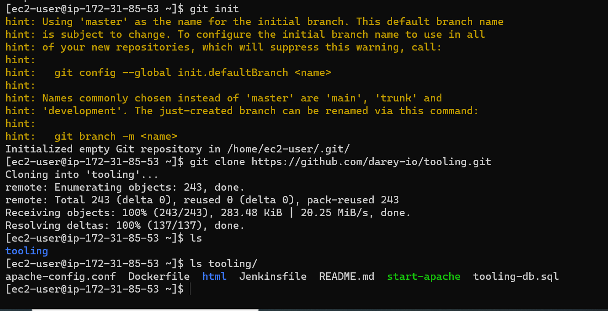

## **PROJECT 7: Devops Tooling Website Solution**
---
---
### **STEP 1 – PREPARE NFS SERVER**

Step 1 – Prepare NFS Server

Spin up a new EC2 instance with RHEL Linux 8 Operating System.

1- Configure LVM on the Server.


Ensure there are 3 Logical Volumes. lv-opt lv-apps, and lv-logs


Instead of formating the disks as xfs format.

`sudo mkfs.xfs -f /dev/nfs-vg/lv-opt`

`sudo mkfs.xfs -f /dev/nfs-vg/lv-apps`

`sudo mkfs.xfs -f /dev/nfs-vg/lv-logs`


Create mount points on /mnt directory for the logical volumes as follow:

Mount lv-apps on /mnt/apps – To be used by webservers

Mount lv-logs on /mnt/logs – To be used by webserver logs

Mount lv-opt on /mnt/opt – To be used by Jenkins server in Project 8

`sudo mkdir /mnt/apps /mnt/logs /mnt/opt`


Mount the volumes

`sudo mount /dev/nfs-vg/lv-apps /mnt/apps`

`sudo mount /dev/nfs-vg/lv-logs /mnt/logs`

`sudo mount /dev/nfs-vg/lv-opt /mnt/opt`

**Use UUID of the device to update `fstab` file**

`sudo blkid`


`sudo vi /etc/fstab`


**Test the configuration and reload the daemon**

`sudo mount -a`

`sudo systemctl daemon-reload`

**Verify your setup** 

`df -h`


2- Install NFS server, configure it to start on reboot and make sure it is u and running

```py
sudo yum -y update

sudo yum install nfs-utils -y

sudo systemctl start nfs-server.service

sudo systemctl enable nfs-server.service

sudo systemctl status nfs-server.service
```


**Set up permission that will allow our Web servers to read, write and execute files on NFS:**

```
sudo chown -R nobody: /mnt/apps
sudo chown -R nobody: /mnt/logs
sudo chown -R nobody: /mnt/opt
```
```
sudo chmod -R 777 /mnt/apps
sudo chmod -R 777 /mnt/logs
sudo chmod -R 777 /mnt/opt
```

`sudo systemctl restart nfs-server.service`

**Export the mounts for webservers’ `subnet cidr` to connect as clients.**

Configure access to NFS for clients within the same subnet:

`sudo vi /etc/exports`

```
/mnt/apps <Subnet-CIDR>(rw,sync,no_all_squash,no_root_squash)

/mnt/logs <Subnet-CIDR>(rw,sync,no_all_squash,no_root_squash)

/mnt/opt <Subnet-CIDR>(rw,sync,no_all_squash,no_root_squash)
```

Esc + :wq!

Edit /etc/exports file:


**export the mounts**

`sudo exportfs -arv`


Check which port is used by NFS and open it using Security Groups (add new Inbound Rule)

`rpcinfo -p | grep nfs`


Important note: In order for NFS server to be accessible from your client, you must also open following ports: TCP 111, UDP 111, TCP 2049, UDP 2049


---
---

### **STEP 2 — CONFIGURE THE DATABASE SERVER**

Install MySQL server

1. Create a database and name it `tooling`

1. Create a database user and name it `webaccess`


```
sudo apt update

`sudo apt install mysql-server`

`sudo mysql`

`ALTER USER 'root'@'localhost' IDENTIFIED WITH mysql_native_password BY 'password';`

`sudo mysql_secure_installation`

To change root password back to default:

`mysql -u root -p`

`ALTER USER 'root'@'localhost' IDENTIFIED WITH auth_socket;`

sudo mysql

CREATE DATABASE tooling;


CREATE USER 'webaccess'@'172.31.80.0/20' IDENTIFIED WITH mysql_native_password BY 'mypass';

SHOW DATABASES;
```


3. Grant permission to `webaccess` user on `tooling database` to do anything only from the `webservers subnet cidr`
   

`GRANT ALL ON tooling.* TO 'webaccess'@'172.31.80.0/20' with grant option;`

`FLUSH PRIVILEGES;`

**update security group to `Open port 3306`**

**Edit bind.address in `/etc/mysql/mysql.conf.d/mysqld.cnf`**

`Sudo vi /etc/mysql/mysql.conf.d/mysqld.cnf`


---
---

### **Step 3 — Prepare the Web Servers**

We need to make sure that our Web Servers can serve the same content from shared storage solutions, in our case – `NFS Server` and `MySQL database.`
You already know that one DB can be accessed for reads and writes by multiple clients. For storing shared files that our Web Servers will use – we will `utilize NFS and mount previously created Logical Volume lv-apps to the folder where Apache stores files` to be served to the users (`/var/www`).

This approach will `make our Web Servers stateless`, which means we will be able to add new ones or remove them whenever we need, and the integrity of the data (in the database and on NFS) will be preserved.

During the next steps we will do following:

- Configure NFS client (this step must be done on all three servers)
- Deploy a Tooling application to our Web Servers into a shared NFS folder
- Configure the Web Servers to work with a single MySQL database

1. Launch a new EC2 instance with RHEL 8 Operating System

2. install NFS client
   
`sudo yum update`

`sudo yum upgrade`

`sudo yum install nfs-utils nfs4-acl-tools -y`

3. `Mount /var/www/` and target the NFS server’s `export for apps`
   
```
sudo mkdir /var/www

sudo mount -t nfs -o rw,nosuid <NFS-Server-Private-IP-Address>:/mnt/apps /var/www
```

`sudo mount -t nfs -o rw,nosuid 172.31.80.237:/mnt/apps /var/www`

`df -h`


**Update `fstab`**

`sudo vi /etc/fstab`

add following line

`<NFS-Server-Private-IP-Address>:/mnt/apps /var/www nfs defaults 0 0`


### **Install Remi’s repository, Apache and PHP**

```
sudo yum install httpd -y

sudo dnf install https://dl.fedoraproject.org/pub/epel/epel-release-latest-8.noarch.rpm

sudo dnf install dnf-utils http://rpms.remirepo.net/enterprise/remi-release-8.rpm

sudo dnf module reset php

sudo yum module list php

sudo dnf module enable php

sudo dnf install php php-opcache php-gd php-curl php-mysqlnd

sudo systemctl start php-fpm

sudo systemctl enable php-fpm

sudo setsebool -P httpd_execmem 1
```

**Locate the *`log folder for Apache` on the Web Server (`/var/log/httpd`) and mount it to NFS server’s export for logs.**

Apache log directory is is: 

`/var/log/httpd`

`sudo mount -t nfs -o rw,nosuid 172.31.80.237:/mnt/logs /var/log/httpd`

**Update fstab**

add:

`sudo vi /etc/fstab`

<NFS-Server-Private-IP-Address>:/mnt/apps /var/www nfs defaults 0 0


**`Fork` the `tooling source code`  from `Darey.io Github Account` to your Github account. **


install Git

```
sudo yum install git

git clone https://github.com/darey-io/tooling.git
```



**`Deploy` the `tooling website’s code` to the Webserver. Ensure that the `html folder` from the repository is `deployed` to `/var/www/html`**

Access the tooling directory and copy the content of html folder into /var/www/hml

`cd /tooling/`

`sudo cp -R html/. /var/www/html`

**Note 1**: Do not forget to open TCP port 80 on the Web Server.


**Note 2**:– check permissions to your `/var/www/html` folder and also `disable SELinux`

 `sudo setenforce 0`


To make this change permanent – open following config file 

`sudo vi /etc/sysconfig/selinux` 

and set 

    SELINUX=disabled


Restart apache

`sudo systemctl restart httpd`

`sudo systemctl status httpd`


### **Update the website’s configuration to connect to the database (in `/var/www/html/functions.php` file).**

 `sudo vi /var/www/html/functions.php`


**Install mysql-client**

`sudo yum install mysql`


### **Apply `tooling-db.sql script` to your database using this command**

    mysql -h <databse-private-ip> -u <db-username> -p <db-name> < tooling-db.sql


 `sudo mysql -u webaccess -p -h 172.31.93.234 tooling < tooling-db.sql`

Connect to the DB server from the web server

    sudo mysql -u webaccess -p -h 172.31.93.234 tooling
 
Access tooling database in the DB server (mysql)

`sudo mysql`

```
mysql> `use tooling;`

Show databases;

show tables;

select * from users;
```


Open the website in a browser 

`http://Web-Server-Public-IP-Address-or-Public-DNS-Name/index.php` 

and login into the website with a user fron users table.


